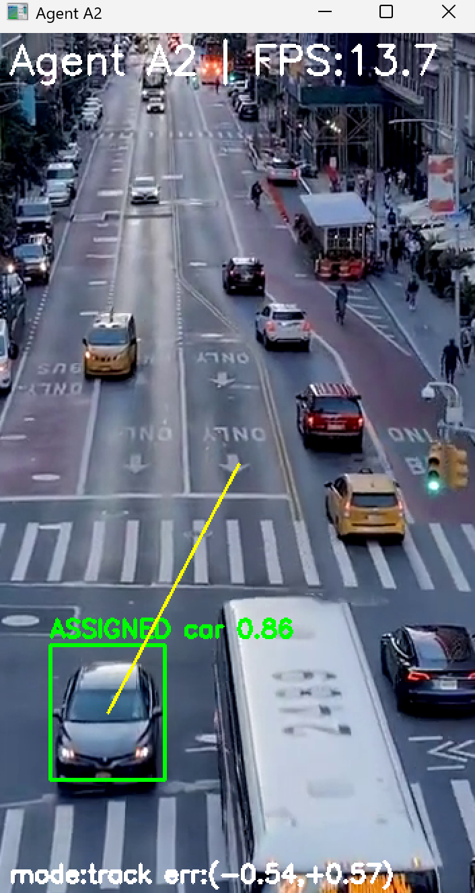
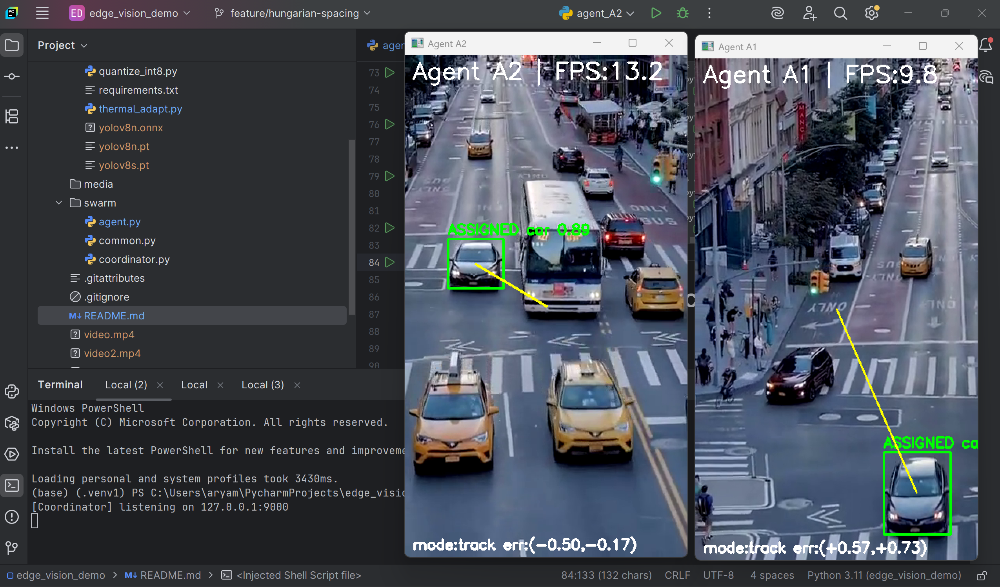

# Edge Vision Swarm Demo

**What this shows (portfolio-ready):**  
A minimal multi-agent vision system: two “agents” (cameras/drones) run YOLOv8n via ONNXRuntime on edge streams and report detections over UDP. A central **Coordinator** fuses detections on a shared horizontal axis and uses the **Hungarian algorithm** to assign different targets to different agents, with a small “spacing nudge” to avoid crowding the same bearing.

**I implemented**: UDP JSON protocol & message schemas, cross-agent fusion on a shared X-axis, Hungarian assignment + per-agent nudges, and the agent overlay (gimbal-error stub).

---

## Table of Contents
- [Architecture](#architecture)
- [Screenshots / GIFs](#screenshots--gifs)
- [Quick Start](#quick-start)
- [CLI Tips](#cli-tips)
- [Results](#results)
- [Implementation Notes](#implementation-notes)
- [What I Reused](#what-i-reused)
- [Next Steps](#next-steps)

---

## Architecture
```

[ Agent A1 ] --detections-->                 ┌──────────────┐
[ Agent A2 ] --detections-->  UDP/JSON  -->  │  Coordinator │
↑             ↑                          │  - global target fusion
└--- assignments & nudges  <-------------│  - Hungarian assignment
└──────────────┘

```

- **Agent** (`swarm/agent.py`): opens a video/webcam, runs YOLOv8n ONNX, sends heartbeat + detections, receives assignments, draws target box + error-to-center overlay.  
- **Coordinator** (`swarm/coordinator.py`): clusters class-consistent detections on a *shared X axis* (via per-agent `--fov_scale_x` / `--fov_offset_x`), then assigns agents→targets with Hungarian; sends optional center-crowding “nudge.”

Project layout:
```

edge/        # ONNX export + (optional) INT8 quantization utilities
swarm/       # multi-agent demo: coordinator + agents
video_*.mp4  # sample left/right views for reproducible runs
media/       # (add screenshots/GIFs here for the README)

````

---

## Screenshots / GIFs

> Put your images/GIFs in `media/` and keep the filenames the same; these links will auto-work.

**Coordinator & two agents (overview)**  


**Coordinator Parallel Run**  


---

## Quick Start

```bash
# 1) Environment (Python 3.10+ recommended)
python -m venv .venv
# Windows: .venv\Scripts\activate
# macOS/Linux:
source .venv/bin/activate

pip install -r edge/requirements.txt

# 2) Export YOLOv8n to ONNX (downloads weights on first run)
python edge/export_onnx.py      # writes edge/yolov8n.onnx

# Optional: INT8 dynamic quantization for smaller model
python edge/quantize_int8.py    # writes edge/yolov8n-int8.onnx

# 3) Start coordinator
python swarm/coordinator.py

# 4) Start two agents (separate terminals)
python swarm/agent.py --id A1 --listen 9101 --model edge/yolov8n.onnx --source video_left.mp4  --fov_scale_x 1.0 --fov_offset_x 0

python swarm/agent.py --id A2 --listen 9102 --model edge/yolov8n.onnx --source video_right.mp4 --fov_scale_x 1.0 --fov_offset_x 1280
````

---

## CLI Tips

* `--source 0` to use a webcam.
* `--conf` and `--iou` to tune detection filtering.
* `--fov_scale_x` / `--fov_offset_x` align each agent’s local center onto a shared global axis for fusion.

---


## Implementation Notes

* **Agent**: heartbeat @ 2 Hz; detection loop with letterbox→ONNX→NMS; draws assignment & error line; optional “nudge” display.
* **Coordinator**: per-class 1-D gating on shared **gx** for clustering; rectangular cost matrix (slew-to-center + confidence penalty); Hungarian assignment; optional center-crowding nudge.

---

## What I Reused

* Pretrained **YOLOv8n** (Ultralytics) exported to ONNX; demo videos.
* `scipy.optimize.linear_sum_assignment` for Hungarian.

---

## Next Steps

* Train model for recognition for real world surveillance
* Work in thermal adaptation into YOLOv8n

